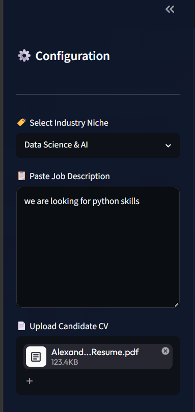
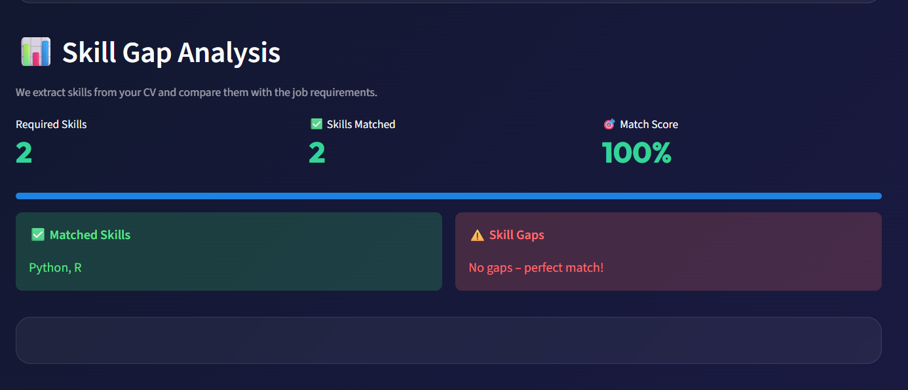
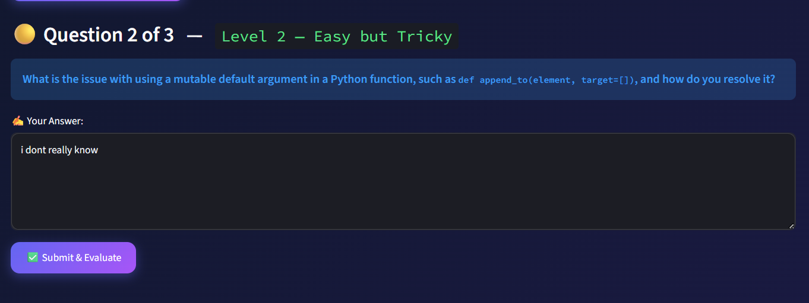
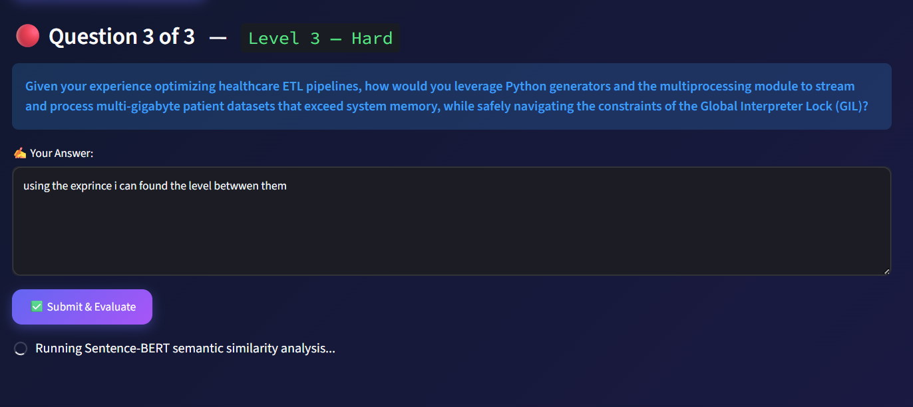
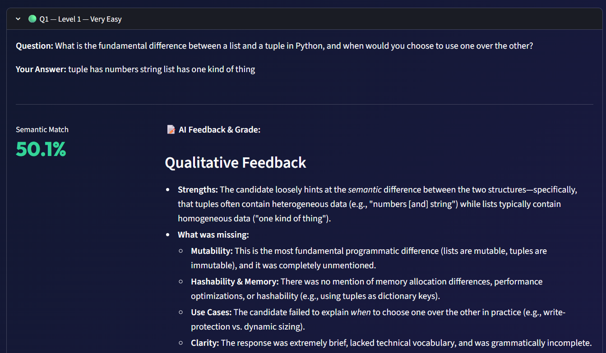
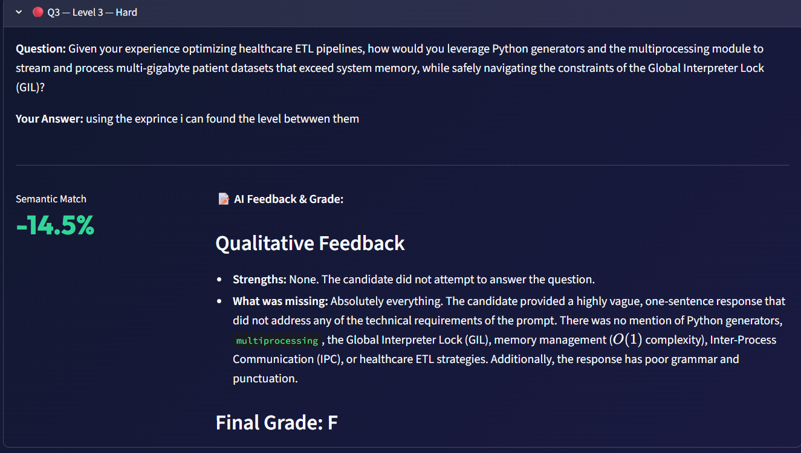

# 🎓 AI Interview Assistant & Candidate Evaluation System (Project B2)

An advanced Natural Language Processing (NLP) and Large Language Model (LLM) application designed to automate candidate screening, extract tech-stack profiles, dynamically generate contextual interviews, and mathematically grade responses using vector spaces.

---

## 👥 Project Credentials
* **Prepared by:**
  * Abdullah Bintaleb 
  * Ziyad Chihani 
* **Supervised by:** Dr. Syed Bukhari
* **Academic Year:** 2026

---

## 🛠️ How It Works (System Workflow)

The application executes a 4-Phase pipeline to analyze, interview, and evaluate candidates:

1. Phase 1: Information Extraction & Analytics: The system ingests the candidate's CV (parsed via PyPDF2/python-docx) and the target Job Description. A rule-based Named Entity Recognition (NER) pipeline via SpaCy maps matching and missing technical skills, rendering interactive comparative dataframes.
2. Phase 2: Contextual Interview Generation: The validated text is fed into Google Gemini 2.5-Flash using the advanced google-genai SDK. The model simulates a senior recruiter to generate 3 targeted technical questions focusing on identified skill gaps.
3. Phase 3: Mathematical Semantic Evaluation: When a candidate inputs an answer, the system generates an ideal baseline response via LLM. Both sentences are vectorized into high-dimensional dense embeddings using Sentence-BERT (all-MiniLM-L6-v2). The actual score is derived via Cosine Similarity:

   Similarity(A, B) = (A · B) / (||A|| ||B||)

4. Phase 4: Structural Feedback Module: The quantitative similarity metric alongside the textual answers are pushed to Gemini to output qualitative diagnostics (strengths/weaknesses) and assign a final descriptive Academic Letter Grade (A, B, C, D, or F).

so first the set up you put the job description 

then Skill Gap Analysis using SpaCy to find match in cv and job description 

then gemeni generate the question and it has type low mid hard 

then you get the feedback of your answers 

also you get score from A to F to the answers 

---

## 🚀 Environment Setup & Installation Guide

Follow these exact steps in your terminal to build the isolated Python environment and run the system.

### Step 1: Create and Activate Conda Environment
Open your Anaconda Prompt and run the following to isolate your dependencies:
conda create -n nlp_env python=3.10 -y
conda activate nlp_env

### Step 2: Install Required Frameworks
Install the necessary processing, engineering, and deep learning dependencies:
pip install streamlit google-genai PyPDF2 python-docx pandas spacy sentence-transformers scikit-learn

### Step 3: Download the SpaCy Language Model
Download the pre-trained statistical NLP pipeline required for the keyword extraction engine:
python -m spacy download en_core_web_sm

---

## 🔑 Runtime Authentication & Execution

The modern google-genai SDK requires explicit environment variables to handle secure API handshakes and prevent 401 UNAUTHENTICATED client errors.

1. but your aApi key in the line 22 from code 

2. Launch the Streamlit presentation layer server:
   streamlit run AI_Interview.py

3. The portal will automatically launch at http://localhost:8501. Fill in the sidebar criteria to initialize the lifecycle.
